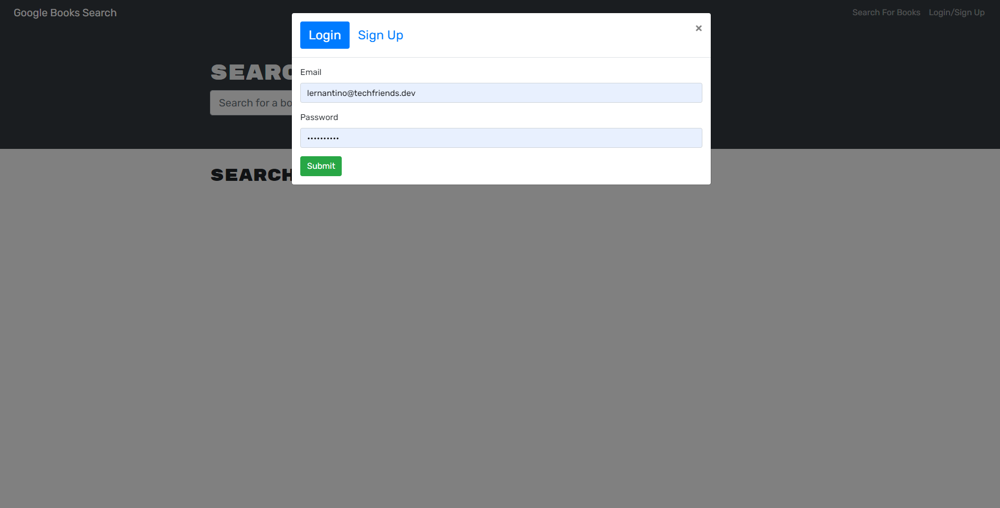

# W21-MERN-Book-Search-Engine

A book search engine using Google that allows users to save their books.

## Table of contents

- [General info](#general-info)
- [Deployed Link](#deployed_link)
- [Screenshots](#screenshots)
- [Setup](#setup)
- [Code](#code)
- [Licenses](#licenses)
- [Inspiration](#inspiration)
- [Contact](#contact)

## General info

This book search engine allows a user to search for books and save them!

## Deployed Link

[Book-Search-Engine]()

## Screenshots

## Setup

- Clone GitHub repository
- run npm installl in root directiory, server directory, and client directory.

## Code and Technologies

- Node.js
- MongoDB
- Apollo
- Express.js
- React

## Licenses

- MIT license
- ISC

## Inspiration

The starter code was cloned and changed to a MERN format by Alex Chigas.

## Contact

- Xavier Marquez (XavierReyMarquez)

- [GitHub](https://github.com/XavierReyMarquez)
